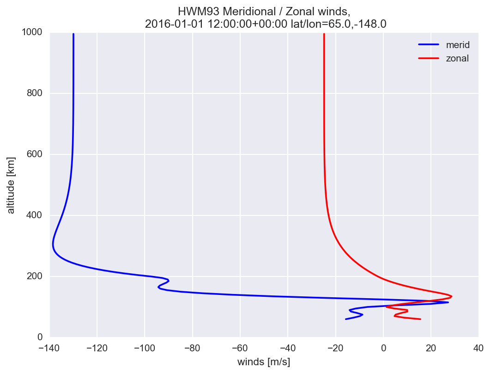

[](https://travis-ci.org/scivision/pyhwm93)
[](https://coveralls.io/github/scivision/pyhwm93?branch=master)
[](https://ci.appveyor.com/project/scivision/pyhwm93)
[](https://pypi.python.org/pypi/pyhwm93)
[](https://pypi.python.org/pypi/pyhwm93)
[](http://pepy.tech/project/pyhwm93)


# HWM93 in Python

NASA Horizontal Wind Model HWM93 in Python.




Works with many Fortran compilers, including:

* Gfortran 5, 6, 7, 8
* Intel `ifort`
* PGI `pgf90`
* Nvidia `flang`


## Install

    pip install -e .
    
test by 

    pytest -sv

## Usage

PyHWM93 can be used from the command line or as an imported module in other programs.
Matlab &ge; R2014b also can use PyHWM93.

### Command line

    RunHWM93 -h
    
Write data to NetCDF (HDF5) with `-o` option.
 
### import module

```python
import pyhwm93
from datetime import datetime

winds = pyhwm93.run(t=datetime(2017,11,12,8), altkm=150., 
                    glat=65., glon=-148., f107a=150, f107=150, ap=4)
```

`winds` is an [xarray.Dataset](http://xarray.pydata.org/en/stable/generated/xarray.Dataset.html)

```
 <xarray.Dataset>
Dimensions:     (alt_km: 1)
Coordinates:
  * alt_km      (alt_km) float64 150.0
Data variables:
    meridional  (alt_km) float64 4.827
    zonal       (alt_km) float64 -20.5
Attributes:
    time:     2017-11-12T08:00:00
    glat:     65.0
    glon:     -148.0
``` 

If you want just a single variable, say
```python
print(winds.zonal.values)
```

### Matlab

If you don't have the Matlab Aerospace Toolbox, you can import this Python module from Matlab &ge; R2014b as
```matlab
py.pyhwm93.run()
```

## Notes

### [Optional] Fortran-only use

Most users don't need this.
```sh
cd bin
cmake ..
cmake --build .
ctest -V
````
   
or

```sh
f2py -c src/hwm93_sub.f  -m hwm93 only: gws5 :
```


### Reference

Original A. E. Hedin Fortran 77 HWM93 [code](ftp://hanna.ccmc.gsfc.nasa.gov/pub/modelweb/atmospheric/hwm93/)
